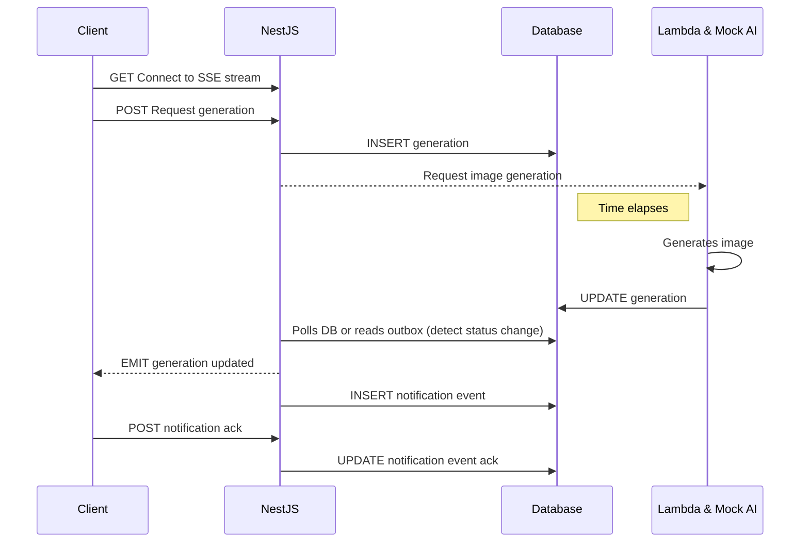

# Task 3 – Real-Time Generation Notifications

## Overview
This document describes a Server-Sent Events (SSE)-based solution for notifying the frontend in real time when an image generation status transitions from `PENDING` to `COMPLETE` or `FAILED`.

The scope is **Frontend <-> API communication only**. The API <-> AI engine flow is unchanged in this document.

---

### Why SSE
- The communication is **one-way** (server -> client notifications).
- Is built on standard HTTP and is simpler to operate some than other solutions.
- Has **native** browser support via `EventSource`.
- Automatic reconnection and support for `Last-Event-ID`.
- First-class support in **NestJS** through `@Sse()` and RxJS.

SSE fits the problem well and minimizes infrastructure complexity.

---

## High-Level Architecture



---

## API Design

### SSE Stream Endpoint

```http
GET /api/notifications/stream
Accept: text/event-stream
Authorization: Bearer <JWT>
```

- Keeps an open HTTP connection.
- Streams events as generation status changes.
- Secured with the same authentication mechanism as REST endpoints.
- Can be implemented using NestJS `@Sse()` decorator.

### Ack Endpoint

```http
POST /api/notifications/:eventId/ack
Authorization: Bearer <JWT>
```

- Can be called by the client after processing an event.
- Used to support replay, deduplication, and offline handling.

---

## Event Format and Schema

The SSE messages has the standard SSE fields:
```
id: <string ULID>
event: <event name>
data: <json data>
retry: <reconnection time in ms>
```

- `retry` is optional and can be used to suggest a reconnection delay to the client

### Data Schema

```
{
  "eventId": "ulid",
  "timestamp": "date string",
  "generationId": "uuid",
  "status": "PENDING | COMPLETE | FAILED",
  "prompt": "string",
  "imageUrls": ["string"],
  "error": {
    "code": "string",
    "message": "string"
  }
}
```

- `imageUrls` is included **only** when `status` is `COMPLETE`
- `error` is included **only** when `status` is `FAILED`

### Example Message

```
id: 01KEZRBD1KD52DBH8CN9YCT2FD
event: generation.status_changed
data: {"eventId":"01KEZRBD1KD52DBH8CN9YCT2FD","timestamp":"<date_string>","generationId":"<uuid>","status":"COMPLETE","prompt":"A beautiful sunset","imageUrls":["https://..."]}
```

---

## System architecture

```folder
.
├── node_modules
└── src
    ├── ai
    ├── config
    ├── notifications
    │   ├── dtos
    │   │   └── generation-status-changed.payload.dto.ts
    │   ├── notification.controller.ts
    │   ├── notification.module.ts
    │   └── services
    │       └── manage-notifications-streams.service.ts
    └── utils
```

- Just set `@Sse()` decorator on a route on `notification.controller.ts`.
- Store the stream on a `Map` on `manage-notifications-streams.service.ts`.

---

## Acknowledgement

- After the event is successfully received, the client calls an **ACK** endpoint.
- The server sets the notification as **acknowledged** with an `ackAt` property.
- Unacknowledged events are replayed on reconnect.
- **ACK** ensures at-least-once delivery while allowing safe client-side deduplication using `eventId`

---

## Offline and Replay

To handle offline users:

- Store all notification events on the `notification_event` table.
- On reconnection:
  - Replay all the events after the `Last-Event-ID` (header automatically sent by browsers).
  - Or replay all unacknowledged events.
  - After replays, stream live events.

This behaviour ensures each message is read at least once with safe client-side deduplication.

---

## Scalability and Security

### Scaling

SSE connections are bound to the single API instance.
In multi-instance deploys, we could use a shared event bus (Redis Pub/Sub) to improve scalability.
But for single-instance no additional infrastructure is required.

### Security

As SSE is HTTP-based, we can:

- Authenticate SSE connections using JWT.
- Authorize events per user.
- Use HTTPS to encrypt the stream.
- Setup a rate-limit:
  - SSE connection attempts
  - ACK endpoint calls

---

## Complexity and Trade-offs

The SSE stream is a simple solution for the problem:

- HTTP-based, simple operational model
- **One-way** real time communication
- Automatic reconnect and `Last-Event-ID` for offline handling
- Native browser support

With a few cons:

- Being **one-way** only, it needs a separate **ACK** endpoint
- May require some **proxy** or **load balancer** tuning for idle timeouts
- Would require a pub/sub for proper scaling

### Other solutions

- **Websockets**
  - More flexible
  - Bidirectional
  - Higher complexity
  - Still would require a pub/sub for scaling
- **Polling**
  - Simpler
  - Ineficient

### Development time estimate

Operational cost is minimal for the MVP, as SSE runs over existing HTTP infrastructure.
Additional costs may include Redis (for multi-instance scaling) and increased DB
usage for event persistence and replay.

Required skills include NestJS, RxJS, HTTP streaming (SSE), and basic frontend
EventSource usage.

Considering the project as is the development time estimate would be initially
of **1-2** days of development, considering:

- New **notification** table on the database
- Creation of **notification* module and controller.
  - An endpoint for the **SSE** stream using `@Sse()`
  - An endpoint for event **acknowledgement**
- Creation of a solution for detecting **generation** changes on the database
  - A worker for **polling** last not-checked generation
  - Or an **outbox table** that records generation status changes
- Singleton service with stream array/map (user to stream if user system is implemented) 
  - A function that emits an event to the stream, called whenever the previously created worker detects database changes

Here's a simple example of how it could be made on NestJS:

```ts
@Controller("api/notifications")
export class NotificationsController {
  constructor(private readonly manageNotificationStreamsService: ManageNotificationStreamsService) {}

  @Sse("stream")
  stream(@Req() req: Request): Observable<SseEvent<GenerationStatusChanges>> {
    // Inferring some user authentication solution
    const userId = req.user.id as string;
    return this.manageNotificationStreamsService.getUserStream(userId);
  }
}

@Injectable()
export class ManageNotificationStreamsService {
  private readonly userStreams = new Map<string, Subject<SseEvent<GenerationStatusChangedPayload>>>();

  getUserStream(userId: string): Observable<SseEvent<GenerationStatusChangedPayload>> {
    let subject = this.userStreams.get(userId);
    if (!subject) {
      subject = new Subject<SseEvent<any>>();
      this.userStreams.set(userId, subject);
    }
    return subject.asObservable();
  }

  emitGenerationStatusChanged(userId: string, payload: GenerationStatusChangedPayload) {
    const subject = this.userStreams.get(userId);
    if (!subject) return; // user not connected; in production you’d also persist for replay

    subject.next({
      id: payload.eventId,
      type: "generation.status_changed",
      data: payload,
    });
  }
}
```
