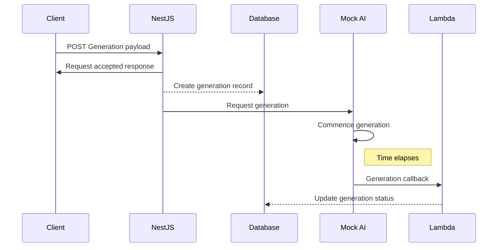

## Introduction

Welcome to the Leonardo.ai (Leo) API Team Technical Challenge!

We’ve put together this repository and the [tasks](TASKS.md) inside to give you a taste of the kind of work you’ll be doing if we’re lucky enough to have you join the team.

This setup is designed to reflect what you can expect at Leo; from the way our projects are structured, the kinds of features we build, the requirements we tackle, and the coding style we follow. It’s a small but realistic glimpse into our world.

## Leo's Work

By this stage in the recruitment process, we hope you’ve got at least a basic idea of what we do here at Leo. In short: we use cutting-edge Artificial Intelligence (AI) to create stunning, fantastical, and sometimes mind-bending imagery and video. With that in mind, we invite you to explore this repository through the lens of how we might bring these amazing creations to life.

You’ve probably guessed that we have a frontend app (we do - leonardo.ai), an API, a database, and of course, our AI systems. Each of these components are represented, in a simulated form, within this codebase.

Within the API team, we focus on delivering high-quality outcomes for our customers - both our internal teammates as well as the broader Leonardo community. To do that, we follow a few key practices:

* We make sure we understand the work clearly before writing any code
* We use a test-first (TDD) approach, so quality is baked in from the outset
* We prioritise resilience and safety throughout the development process
* We lean into over-communication so our intent is always clear, and future teammates don’t have to work too hard to get up to speed and follow along

This technical challenge has been designed with those principles in mind. As you dig in, we encourage you to keep them front and center.

## Repository & System Structure

You'll find a small number of directories in this repository and each serves a purpose in supporting this example of each part of the Leonardo platform. These are:

### -- Prisma

Here you'll find a basic database schema and starting migrations that support the data storage requirements of the system. We use Prisma at Leo and we will challenge you as part of this take home assignment to give us an idea of your familiarity with the tool. Any migrations you generate should be stored in the 'migrations' directory. You should update the schema as you go to include any changes you make and allow TypeScript access to the generated typings.

### -- Scripts

The scripts directory is there to help set the platform up when you run ```npm run setup```. You shouldn't need to modify these files but being familiar with them might add a little more knowledge about the system to your toolbelt. 

### -- Services

The heart of our example system. Here you will find the following:

```folder
├── services/
│   ├── lambdas/           # The callback Lambda function
│   ├── mock-ai-server/    # Our Mock AI server
│   └── nestjs/            # The NestJS application for generation requests
```

The majority of your work for the challenge tasks will be in these directories.

## How does this all fit together?

Each of these micro applications serves a purpose in providing a working system that simulates a small piece of the Leo platform and the tasks we set to you in this challenge are all designed to incrementally enhance it. Let's look at each app and see what they do:

### -- NestJS

This is our API layer in the context of this repository, an entry point to allow someone to request an image generation be created. For now this is all we support, but that's going to change with your help (see [TASKS.md](TASKS.md)) on how we want you to get started doing that.

### -- Mock AI Server

The Mock AI server is of course - as the name suggests - not real AI. It exists in this context to behave in the way real-world generations do, at least from a networking and latency perspective. As you might imagine making a call to an AI service and asking for an image to be created is not instantanous, it takes a number of seconds, or even up to a minute or more to complete, and as such there is a lag between the time we ask the service to start generating, to the time it provides a completed asset back. This lag is simulated in the AI service by a sleep() of ~8 seconds. We need to take this into account when we're working on our tasks in this challenge so do bear this is mind.

### -- Lambdas

We use AWS Lambda's heavily at Leo currently and here is no different. We have provided a single Lambda function to act as a callback target for when the Mock AI Server is finished "creating" a generation. This callback is important to our working process here in this repository as it has the responsibility of updating a generation record in the database from 'pending' to 'complete'. Again, this is an important concept to grasp and be aware of as you consider the implementation of your tasks.

## Sequence of events

The following diagram illustrates the working process you'll find in this repository:



(you can find an export of this sequence diagram at docs/OVERVIEW-1.png)

## Finishing Up

Hopefully by now you've got a better idea of what's in this repository and how it all comes together to provide a foundation upon which to do you work. Remember, this is the basis of the platform and each task is designed to add something new to it.

We want to see your best efforts to make this fledgling service secure, reliable, scalable, and usable. Each task you are taking on builds on from the last and by the end we should have a better system than we started with.

Good luck :handshake:
